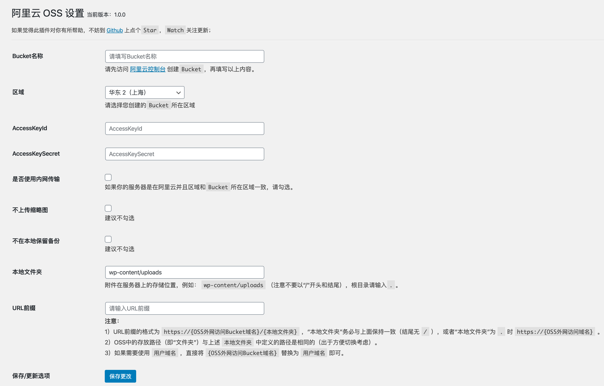

# OSS Aliyun

使用阿里云对象存储 OSS 作为附件存储空间的 WordPress 插件

> 使用 WordPress Playground 在线预览 [OSS Aliyun](https://wordpress.org/plugins/oss-aliyun/?preview=1) 插件

## 插件特色

- [x] 可配置是否上传缩略图和是否保留本地备份
- [x] 本地删除可同步删除阿里云对象存储 OSS 中的文件
- [x] 支持阿里云对象存储 OSS 绑定的用户域名
- [x] 支持替换数据库中旧的资源链接地址
- [x] 支持阿里云对象存储 OSS 完整地域使用
- [x] 支持同步历史附件到阿里云对象存储 OSS
- [x] 支持阿里云 OSS 图片处理
- [x] 支持上传文件自动重命名
- [x] 支持使用 ECS 的 RAM 操作
- [x] 支持原图保护
- [x] 支持 `wp-cli` 命令上传/删除文件

## 安装

### 后台安装（推荐使用）

WordPress 后台安装插件页面搜索`OSS Aliyun`，点击安装

### 下载源码

从 GitHub 下载源码，通过 WordPress 后台上传安装，或者直接将源码上传到 WordPress 插件目录`wp-content/plugins`，然后在后台启用

GitHub 下载节点：[https://github.com/sy-records/aliyun-oss-wordpress/releases/latest](https://github.com/sy-records/aliyun-oss-wordpress/releases/latest)

## 修改配置

- 方法一：在 WordPress 插件管理页面有设置按钮，进行设置
- 方法二：在 WordPress 后台管理左侧导航栏`设置`下`阿里云OSS设置`，点击进入设置页面

## 常见问题

- 通过文件 URL 访问图片无法预览而是以附件形式下载？

因为 Bucket 是 2019 年 9 月 23 日后创建的，使用默认域名时会自动下载，需要绑定自有域名访问。具体参考[阿里云文档](https://help.aliyun.com/document_detail/142631.html)。

- 如果存在第三方插件或者主题自带上传功能，内容上传到`本地文件夹`(即默认`wp-content/uploads`)中，怎么上传到 oss 中？

解决方案有两种，推荐使用第二种。

一是修改第三方插件或者主题的上传功能，调用插件的`oss_file_upload`方法（不推荐，一般人不会修改）
二是使用对象存储 OSS 提供的回源功能，配置为镜像方式。如果配置了镜像回源，当用户对该存储空间内一个不存在的文件进行 GET 操作时，OSS 会向回源地址请求这个文件，返回给用户，同时会将该文件存入 OSS。这样就达到了上传到 OSS 的需求。具体配置参考阿里云文档[设置回源规则](https://help.aliyun.com/document_detail/31906.html)

## 插件截图

